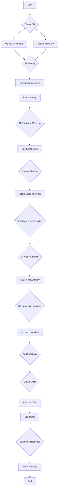

# Emirati Pathways - Complete Recruiter Workflow

This document provides a comprehensive walkthrough of the end-to-end recruiter workflow in the Emirati Pathways platform, from creating a job description to hiring a candidate. It includes features you asked about, such as JD creation, vacancy posting, and video interviews.

## Phase 1: Job Creation & Candidate Sourcing

**Starting Point:** Recruiter needs to fill a new position.

### 1. Create Job Description (JD)

The platform offers two ways to create a job description:

**Option A: Upload Existing JD**

- **Navigate to:** Recruiter Dashboard → Create Opportunity
- **Action:** Select "Upload Document"
- **Process:**
    1. Upload a JD file (PDF, DOCX, TXT).
    2. AI-powered parsing extracts key information (job title, skills, experience, qualifications).
    3. The system automatically fills the JD wizard with the parsed data.
    4. Recruiter reviews and edits the pre-filled information.

**Option B: Create Manually with AI Assistance**

- **Navigate to:** Recruiter Dashboard → Create Opportunity
- **Action:** Select "Create Manually"
- **Process:**
    1. A step-by-step wizard guides the recruiter through creating the JD.
    2. **AI Content Generation:** The system provides AI-powered suggestions for:
        - Job responsibilities
        - Required skills and qualifications
        - Experience levels
    3. **Completion Scoring:** A scoring mechanism ensures the JD is comprehensive and high-quality.

### 2. Post Vacancy & Source Candidates

- **Action:** Once the JD is finalized, click "Post Vacancy".
- **Process:**
    1. The vacancy is posted to the Emirati Pathways job board.
    2. **AI Candidate Matching:** The system automatically sources and matches candidates from the platform's talent pool based on:
        - Skills and qualifications
        - Experience
        - Career goals
        - Employment status
    3. Matched candidates are automatically added to the **shortlist** for the new vacancy.

## Phase 2: Candidate Shortlisting & Screening

### 3. Review Shortlisted Candidates

- **Navigate to:** `/recruiter/shortlist/<jd_id>`
- **Dashboard:**
    - Total Shortlisted
    - Contacted
    - Interviews
    - Average Match Score
- **Actions:**
    - **View Details (ℹ️):** Review full candidate profile, including match details.
    - **Update Status:** Change status from "Shortlisted" to "Contacted".

### 4. Video Interview Screening (AI-Powered)

- **Action:** For promising candidates, initiate a one-way video interview.
- **Process:**
    1. Recruiter sends a link to the candidate with a set of pre-defined questions.
    2. Candidate records video responses to the questions on the platform.
    3. **AI Analysis:** The platform analyzes the video responses for:
        - **Communication Skills:** Clarity, confidence, and articulation.
        - **Sentiment Analysis:** Positive, negative, or neutral tone.
        - **Keyword Matching:** How well the candidate's answers match the job requirements.
    4. **AI-Generated Summary:** The recruiter receives a summary of the AI analysis, including a transcript and key insights.

**Note:** The current implementation has a `DemoVideoModal.tsx` component, but the full AI analysis functionality is not yet integrated into the recruiter workflow. The backend supports a "video" interview type, but the AI analysis part is a future enhancement.

## Phase 3: Live Interviews & Offers

This phase follows the process I described earlier:

5. **Schedule Live Interviews** (Phone, Video, In-Person)
6. **Add Interview Feedback** (Ratings & Recommendations)
7. **Create Job Offer** (Multi-step wizard)
8. **Manage & Approve Offers**
9. **Send Offer & Track Response**

## Complete End-to-End Flowchart

This provides a complete picture of the recruiter's journey on the Emirati Pathways platform. Please let me know if you have any more questions!

