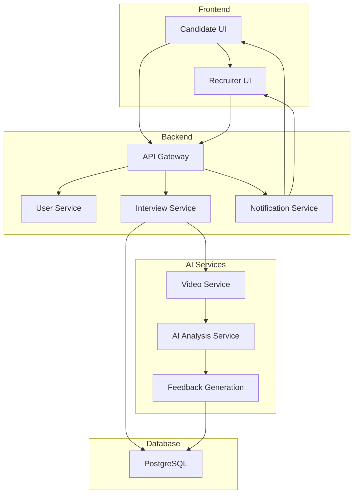

# AI-Powered Video Interview Platform - System Architecture & User Flows

This document outlines the system architecture and user flows for the proposed AI-powered live video interview platform with dual-sided feedback.

## 1. System Architecture

The platform will be built on a microservices architecture to ensure scalability, maintainability, and independent deployment of components.

### Key Components:

| Component | Description | Technology Stack |
|---|---|---|
| **Frontend** | User interface for candidates and recruiters | React, TypeScript, WebRTC, Socket.IO |
| **Backend** | Core application logic, user management, and API gateway | Python, Flask, PostgreSQL, Socket.IO |
| **Video Service** | Real-time video and audio streaming | WebRTC, Janus/Kurento (Media Server) |
| **AI Analysis Service** | Real-time analysis of video, audio, and text | Python, OpenCV, SpeechRecognition, NLTK/spaCy, TensorFlow/PyTorch |
| **Notification Service** | Sends real-time notifications to users | RabbitMQ/Redis, Socket.IO |
| **Database** | Stores user data, interview details, and analysis results | PostgreSQL |

### Architecture Diagram:

## 2. User Flows

### 2.1. Candidate Flow

1. **CV & Application:**
   - Candidate uploads CV via CV Builder.
   - AI matches CV to relevant vacancies.
   - Candidate applies for a job.

2. **Interview Invitation:**
   - Candidate receives an email and in-app notification with an invitation for a live video interview.
   - Clicks the link to enter the virtual waiting room.

3. **Live Interview:**
   - Joins the video call with the recruiter.
   - The interview is recorded and analyzed in real-time by the AI.

4. **Post-Interview Feedback:**
   - After the interview, the candidate receives personalized feedback:
     - **Areas for Improvement:** Communication clarity, confidence, and articulation.
     - **Recommended Training:** Links to relevant courses on the platform.
     - **Mentor/Advisor Matching:** Suggestions for mentors who can help with interview skills.

### 2.2. Recruiter Flow

1. **Review & Invite:**
   - Recruiter receives a notification for a new application.
   - Reviews the candidate's profile (CV, portfolio, assessments).
   - Invites the candidate for a live video interview.

2. **Live Interview & AI Monitoring:**
   - Recruiter joins the video call.
   - **AI Co-Pilot:** During the interview, the recruiter sees real-time AI insights:
     - **Fairness Score:** Monitors for potential bias in questions and language.
     - **Clarity Score:** Assesses how clearly the recruiter is communicating.
     - **Sentiment Analysis:** Tracks the emotional tone of the conversation.

3. **Post-Interview Feedback:**
   - Recruiter receives a detailed report on their own performance:
     - **Fairness & Bias Report:** Highlights any instances of potential bias.
     - **Clarity & Communication Analysis:** Suggestions for improving communication.
     - **Best Practices:** Recommendations for conducting more effective and equitable interviews.

## 3. Gap Analysis

Based on the current codebase, here are the key features that need to be built:

- **Live Video Call Platform:** No WebRTC or media server integration currently exists.
- **AI Monitoring & Analysis Engine:** The core AI models for real-time analysis need to be developed.
- **Dual-Sided Feedback System:** The UI and backend logic for generating and displaying feedback for both candidates and recruiters need to be created.
- **Application & Notification Integration:** The existing application and notification systems need to be extended to support the video interview workflow.

This architecture and user flow design provides a solid foundation for building this innovative feature. The next step is to create a detailed implementation plan with technical specifications for each component.

