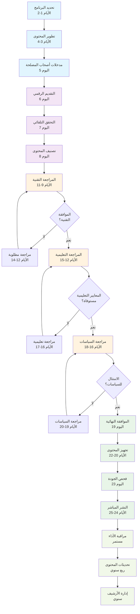

# مخطط سير عمل محتوى البرامج المدرسية

## كود مخطط Mermaid

## نظرة عامة على العملية

يوضح هذا المخطط دورة حياة المحتوى الشاملة لمدة 25 يوماً للبرامج المدرسية، من تحديد البرنامج الأولي وحتى الصيانة المستمرة. تم تصميم العملية لضمان محتوى تعليمي عالي الجودة ومتوافق وجذاب.

### تفصيل المراحل:

- **إنشاء المحتوى (الأيام 1-5)**: المربعات الزرقاء الفاتحة تُظهر تحديد البرنامج والتطوير ومدخلات أصحاب المصلحة
- **التقديم والمعالجة (الأيام 6-8)**: المربعات البنفسجية للتقديم الرقمي والمعالجة الأولية
- **المراجعة متعددة المستويات (الأيام 9-18)**: المربعات البرتقالية تُظهر المراجعات التقنية والتعليمية والسياسية
- **الموافقة والنشر (الأيام 19-25)**: المربعات الخضراء لعملية الموافقة النهائية والنشر
- **الصيانة المستمرة**: المربعات الخضراء الفاتحة للمراقبة والتحديثات المستمرة

### الميزات الرئيسية:

- **نقاط القرار**: الأشكال المعينية تشير إلى نقاط تفتيش الموافقة
- **دورات المراجعة**: حلقات التغذية الراجعة تضمن الجودة والامتثال
- **مؤشرات الجدول الزمني**: نطاقات الأيام تُظهر المدة المتوقعة لكل مرحلة
- **الترميز اللوني**: التمييز البصري بين مراحل سير العمل المختلفة
