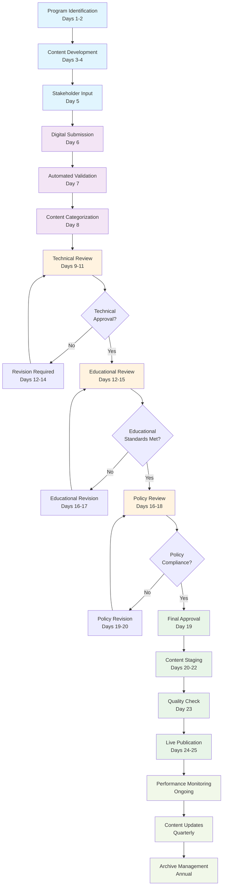

# School Programs Content Workflow Diagram

## Mermaid Diagram Code

## Process Overview

This workflow diagram illustrates the comprehensive 25-day content lifecycle for School Programs, from initial program identification through ongoing maintenance. The process is designed to ensure high-quality, compliant, and engaging educational content.

### Phase Breakdown:

- **Content Creation (Days 1-5)**: Light blue boxes showing program identification, development, and stakeholder input
- **Submission & Processing (Days 6-8)**: Purple boxes for digital submission and initial processing
- **Multi-Level Review (Days 9-18)**: Orange boxes showing technical, educational, and policy reviews
- **Approval & Publication (Days 19-25)**: Green boxes for final approval and publication process
- **Ongoing Maintenance**: Light green boxes for continuous monitoring and updates

### Key Features:

- **Decision Points**: Diamond shapes indicate approval checkpoints
- **Revision Cycles**: Feedback loops ensure quality and compliance
- **Timeline Indicators**: Day ranges show expected duration for each phase
- **Color Coding**: Visual distinction between different workflow phases
