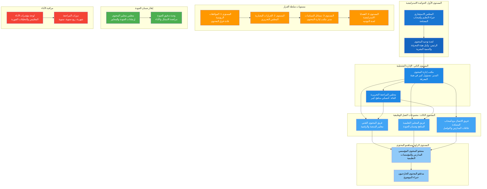

# مخطط الهيكل الإداري

## كود مخطط Mermaid

## نظرة عامة على إطار الحوكمة

يوضح هذا المخطط للهيكل الإداري التسلسل الهرمي الشامل ذو الأربعة مستويات لإدارة محتوى البرامج المدرسية، مما يضمن المساءلة والجودة والتوافق الاستراتيجي.

### هيكل المستويات:

**المستوى الأول - الحوكمة الاستراتيجية (الأزرق الداكن)**
- لجنة توجيه المحتوى برئاسة وكيل هيئة المعرفة والتنمية البشرية
- المجلس الاستشاري مع خبراء التعليم وممثلي أصحاب المصلحة
- مسؤول عن التوجه الاستراتيجي وقرارات السياسات

**المستوى الثاني - الإدارة التشغيلية (الأزرق المتوسط)**
- مكتب إدارة المحتوى بقيادة مسؤول كبير في هيئة المعرفة
- مجلس المراجعة التحريرية مع أخصائيي المناهج
- يتولى العمليات اليومية والإشراف على المحتوى

**المستوى الثالث - مجموعات العمل الوظيفية (الأزرق الفاتح)**
- فريق المحتوى التقني لمعايير المنصة
- فريق المعايير التعليمية لجودة المناهج
- فريق الاتصال مع أصحاب المصلحة لعلاقات المدارس

**المستوى الرابع - مساهمو المحتوى (الأزرق الفاتح جداً)**
- منشئو المحتوى المؤسسي من المدارس
- المدققون الخارجيون وخبراء الموضوع
- التطوير الأساسي للمحتوى والتحقق من صحته

### الإطار الداعم:

**سلطة القرار (البرتقالي)**
- أربعة مستويات من سلطة اتخاذ القرار
- مسارات تصعيد واضحة لأنواع مختلفة من القرارات
- يضمن الإشراف المناسب في كل مستوى

**ضمان الجودة (الأخضر)**
- مجلس معايير المحتوى للإرشادات والمعايير
- وحدة تدقيق الجودة لمراقبة الامتثال
- عمليات مراقبة الجودة المنهجية

**مراقبة الأداء (الأحمر)**
- لوحة مؤشرات الأداء للتحليلات الفورية
- دورات مراجعة منتظمة للتحسين المستمر
- دعم اتخاذ القرارات المبنية على البيانات
