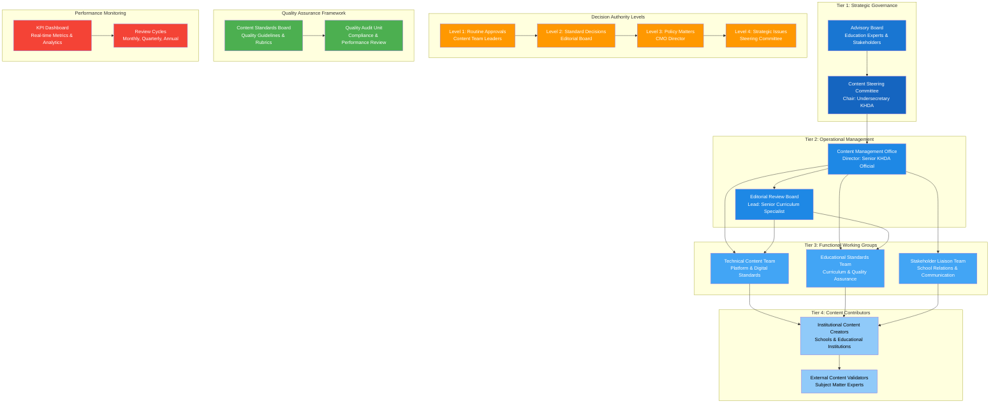

# Governance Structure Diagram

## Mermaid Diagram Code

## Governance Framework Overview

This governance structure diagram illustrates the comprehensive four-tier hierarchy for managing School Programs content, ensuring accountability, quality, and strategic alignment.

### Tier Structure:

**Tier 1 - Strategic Governance (Dark Blue)**
- Content Steering Committee chaired by KHDA Undersecretary
- Advisory Board with education experts and stakeholder representatives
- Responsible for strategic direction and policy decisions

**Tier 2 - Operational Management (Medium Blue)**
- Content Management Office led by Senior KHDA Official
- Editorial Review Board with curriculum specialists
- Handles day-to-day operations and content oversight

**Tier 3 - Functional Working Groups (Light Blue)**
- Technical Content Team for platform standards
- Educational Standards Team for curriculum quality
- Stakeholder Liaison Team for school relations

**Tier 4 - Content Contributors (Lightest Blue)**
- Institutional content creators from schools
- External validators and subject matter experts
- Primary content development and validation

### Supporting Framework:

**Decision Authority (Orange)**
- Four levels of decision-making authority
- Clear escalation paths for different types of decisions
- Ensures appropriate oversight at each level

**Quality Assurance (Green)**
- Content Standards Board for guidelines and rubrics
- Quality Audit Unit for compliance monitoring
- Systematic quality control processes

**Performance Monitoring (Red)**
- KPI Dashboard for real-time analytics
- Regular review cycles for continuous improvement
- Data-driven decision making support
